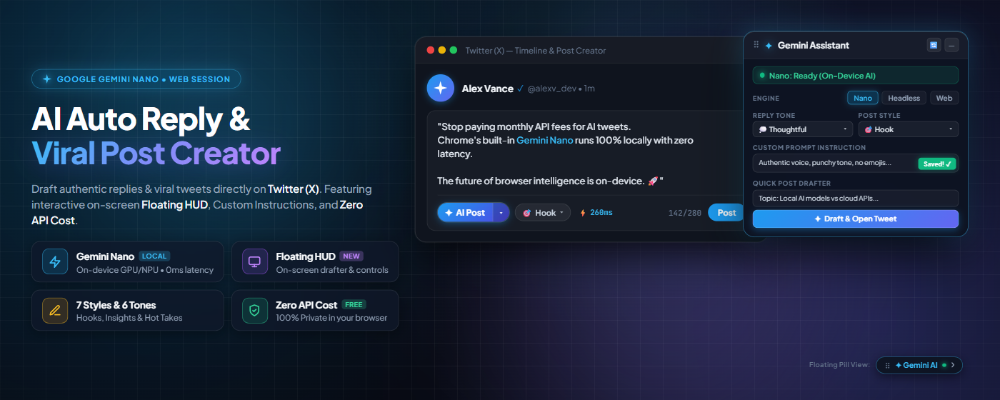

# Twitter (X) AI Assistant: Reply & Post Creator
 


Generate intelligent auto-replies and craft viral tweets directly on **Twitter (X)** without requiring any paid API keys.

---

## 🌟 Supported AI Engines

You can choose your preferred engine anytime with one click in the extension popup:

1. **⚡ Gemini Nano (Built-in On-Device AI)** *(Recommended)*:
   - **0 tabs opened**.
   - Runs directly inside Chrome using your computer's local hardware (GPU/NPU).
   - 100% private, works offline, and generates replies in under a second.
2. **🌐 Headless Web (Google Cookie Session)**:
   - **0 tabs opened**.
   - Sends silent background requests directly using your active Google login session cookies.
3. **🗂️ Gemini Web Tab (DOM Automation)**:
   - Automates the real [gemini.google.com/app](https://gemini.google.com/app) chat interface.
   - Includes an **Auto-close tab** toggle so temporary background tabs vanish automatically once the reply is pasted.

---

## 🔍 How to Check if Gemini Nano is Supported in Your Chrome

Before using **Option 1 (Gemini Nano)**, verify if your Chrome browser supports on-device AI:

### Quick 5-Second Test:
1. Open any webpage in Chrome.
2. Press `F12` (or right-click anywhere and choose **Inspect**), then click the **Console** tab.
3. Paste the following command and hit `Enter`:
   ```javascript
   'LanguageModel' in window || 'ai' in window
   ```
4. **If it returns `true`**: 🎉 Gemini Nano is supported on your browser!
5. **If it returns `false`**: Follow the steps below to enable it.

### How to Enable Gemini Nano in Chrome:
1. In your address bar, go to:
   ```text
   chrome://flags/#prompt-api-for-gemini-nano
   ```
   Set it to **Enabled**.

2. Next, go to:
   ```text
   chrome://flags/#optimization-guide-on-device-model
   ```
   Set it to **Enabled BypassPerfRequirement** (this ensures Chrome downloads the model regardless of hardware constraints).

3. Click the blue **Relaunch** button at the bottom of Chrome.

4. Open:
   ```text
   chrome://components
   ```
   Find **Optimization Guide On Device Model**. If the version is `0.0.0.0`, click **Check for update** to begin the one-time local model download (~1-2 GB).

---

## 💻 How to Install the Extension on Your PC / Laptop

Anyone can install and run this extension locally in under 2 minutes:

### 1. Download or Clone the Repository
- **Via Git**:
  ```bash
  git clone https://github.com/gomedz/twitter-auto-reply.git
  ```
- **Or via ZIP**:
  - Click the green **Code** button at the top of this repository on GitHub.
  - Select **Download ZIP** and extract the folder to your preferred location.

### 2. Load the Extension into Google Chrome
1. Open Google Chrome.
2. Type `chrome://extensions/` in the address bar and hit `Enter`.
3. In the top-right corner, turn ON the **Developer mode** toggle.
4. In the top-left corner, click the **Load unpacked** button.
5. In the file picker, select the folder containing `manifest.json` (the extracted/cloned folder).
6. The extension **"Twitter AI Assistant (Reply & Post Creator)"** is now installed! Pin it to your Chrome toolbar for quick access.

---

## 🚀 How to Use on Twitter (X)

### 1. Auto-Replying to Tweets ("✦ AI Reply")
- Open any tweet or thread on [x.com](https://x.com).
- Click into the reply box or open the reply dialog.
- The button will automatically show **"✦ AI Reply ▾"**.
- Click **AI Reply** to generate with your default tone, or click `▾` to choose a specific tone (*Quick*, *Agree*, *Thoughtful*, *Witty*, *Question*, *Counter-Point*).
- The AI crafts the response and auto-inserts it directly into the reply box!

### 2. Creating New Posts ("✦ AI Post")
- Click into the *"What is happening?!"* box at the top of your feed, or click the sidebar **Post** button.
- The button automatically adapts to **"✦ AI Post ▾"**.
- **Draft Polish Mode**: Type your raw thoughts, bullet points, or draft into the box, then click **AI Post** (or pick a style like *Engaging Hook* or *Insight & Value*) to polish and optimize it.
- **Topic Prompt Mode**: If the box is empty, clicking **AI Post** pops up a prompt bar asking for your topic or idea! Enter your thought and hit **Generate ✦** to have it typed into the box.

### 3. Standalone Popup Post Creator
- Click the extension icon in Chrome and switch to the **✍️ Post Creator** tab.
- Enter any topic or prompt, select your preferred post style, and click **Generate Tweet ✦**.
- Preview, edit, copy to clipboard, or click **Post on X ↗** to open a new tweet ready to send!

---

## 🛡️ Privacy & Security

- **No API Keys Needed**: Operates without any third-party or paid API credentials.
- **Local & Private**: When using Gemini Nano, inference happens 100% locally on your machine without transmitting any data over the internet.
- **No Credentials Stored**: No passwords, tokens, or Google account credentials are ever logged, stored, or sent to external servers.

---

## ☕ Support Us

**If you found this project helpful, consider buying me a coffee!**
   - Trakteer ID : [teer.id/gmd.inc](https://teer.id/gmd.inc)
   - Buy me a coffee : [buymeacoffee.com/gmd.inc](https://www.buymeacoffee.com/gmd.inc)
   - Cypto : 0x8cD08357a2a56ed90D0137AE7bee324bd772B90d

---

## 📄 License

This project is licensed under the MIT License - see the [LICENSE](LICENSE) file for details.
