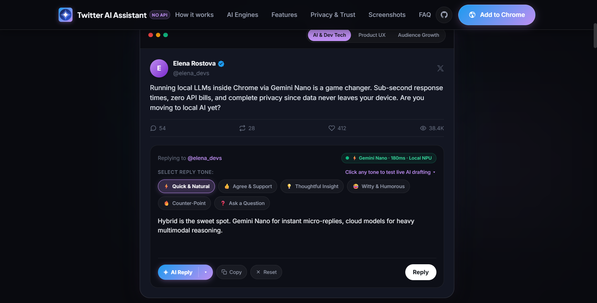

# 𝕏 (Twitter) Auto Reply & Post Creator No API — Marketing Landing Page

A minimalist, high-converting, developer-focused landing page for the **"𝕏 (Twitter) Auto Reply & Post Creator No API"** Google Chrome Extension.



---

## 🌟 Key Product Features Highlighted

- **Three AI Engines**:
  1. **⚡ Gemini Nano**: 100% on-device local GPU/NPU inference, sub-second latency, zero cloud network calls, complete privacy.
  2. **🌐 Headless Direct**: Silent background communication utilizing active Google login session cookies without API keys.
  3. **🗂️ Web Tab Automation**: Automated Gemini tab with auto-close feature that vanishes upon completion.
- **6 Context-Aware Reply Tones**: Quick & Natural, Agree & Supportive, Thoughtful Insight, Witty & Humorous, Counter-Point, Ask a Question.
- **Dual-Mode Post Creator**: Standalone tweet creator with Topic Prompt mode and Draft Polish mode.
- **Privacy & Trust Shield**: 100% client-side, zero telemetry, zero credential tracking, open-source under MIT.
- **Direct Chrome Web Store Link**: Wired directly to the live listing: `https://chromewebstore.google.com/detail/bgpgjojfnfoepfedcinphjmmgkkffhpo`

---

## 📁 Project Architecture & Structure

```
website/
├── index.html                   # Semantic, accessible HTML5 structure
├── styles/
│   ├── main.css                 # Design system tokens, typography, resets, layout
│   ├── components.css           # Navigation, tweet card, tone pills, engine comparison, FAQ
│   └── animations.css           # Smooth glows, typing carets, scroll reveals, reduced-motion fallbacks
├── scripts/
│   ├── tones-data.js            # Sample tweets dataset across 3 categories & 6 response tones
│   ├── mockup.js                # Interactive hero tweet simulation, typing engine, tone selector
│   ├── interactions.js          # Scroll reveal observer, navbar blur, mobile drawer, tabs, FAQ
│   └── app.js                   # Application coordinator entry point
└── assets/
    ├── icons/                   # Chrome extension icon assets (16px, 48px, 128px)
    └── images/                  # Product banners, feature marquee, and popup interface screenshots
```

---

## 🚀 Running Locally

You can preview this landing page using any local static web server:

### Option 1: Python
```bash
python -m http.server 8080 --directory website
```
Then visit `http://localhost:8080` in your browser.

### Option 2: Node.js (npx serve)
```bash
npx serve website
```

### Option 3: VS Code / Live Server
Right-click `website/index.html` and select **Open with Live Server**.

---

## 🎨 Design System

- **Aesthetic**: Developer-tool minimalist, generous negative space, grid-based, low cognitive load.
- **Theme**: Dark mode (`#090a0f`, `#0e1017`, `#131622`).
- **Accent**: Soft Gemini violet/purple (`#be8ef2` / `#d6b5fa`) paired with Twitter blue (`#1d9bf0`).
- **Typography**:
  - Headings: `Plus Jakarta Sans`, 700 / 800 weight
  - Body: `Inter`, 400 / 500 / 600 weight
  - Monospace: `JetBrains Mono` / system monospace
- **Accessibility**:
  - WCAG AA high-contrast compliance
  - Full keyboard navigability on interactive pills, accordion, and tabs
  - `@media (prefers-reduced-motion: reduce)` support
